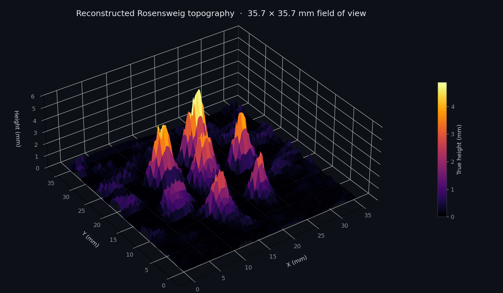
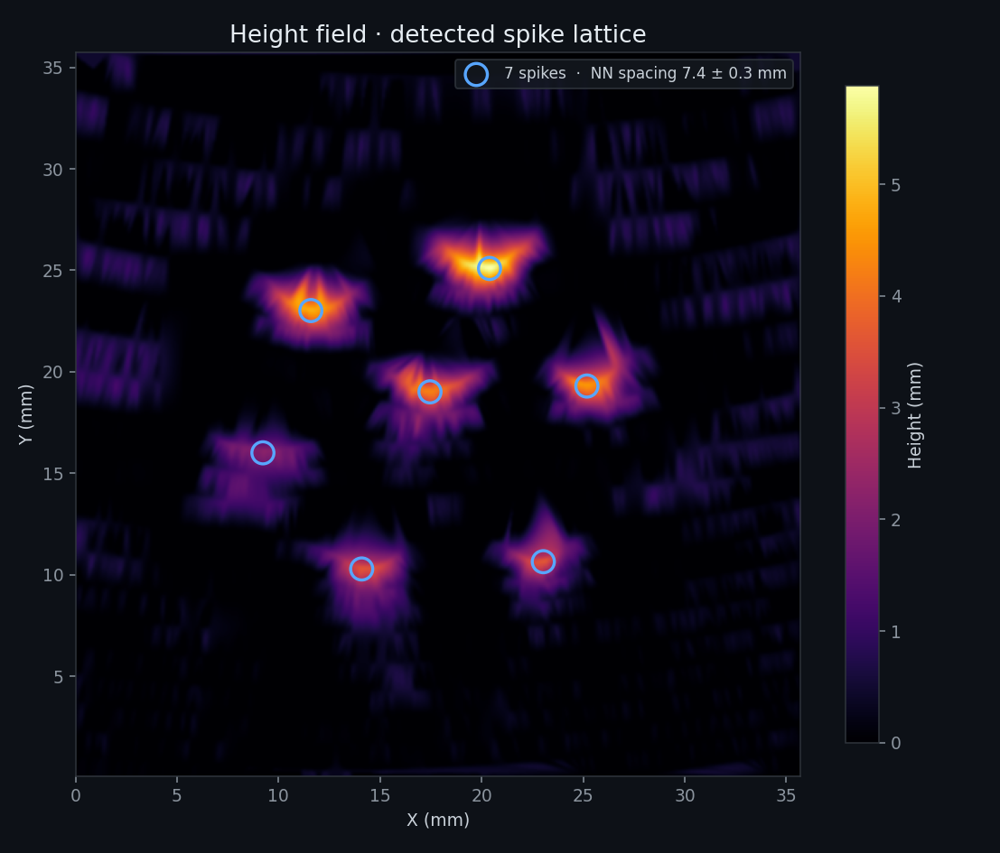

# Ferrofluid Topology

**Structured-light 3D reconstruction of the Rosensweig instability in magnetised ferrofluid.**

Fringe-projection profilometry, the calibration and code for it, and the measurement it was built to make: the critical wavelength of the
spike lattice that forms when a ferrofluid surface is destabilised by a normal
magnetic field.

<p align="center">
  
</p>

> **Research project · April – June 2026**
> Measured Rosensweig critical wavelength **8.3 ± 0.4 mm at 10.6 mT**, against
> **7.6 – 9.8 mm** predicted by a ferrohydrodynamic continuum model.

---

## The problem

Put a dish of ferrofluid in a vertical magnetic field and past a critical field
strength the flat surface stops being stable. It buckles into a hexagonal lattice of
spikes — the **Rosensweig instability**. The spacing of those spikes is set by a
competition between magnetic energy, gravity and surface tension, and continuum
theory predicts it:

$$\lambda_c = \frac{2\pi}{k_c}, \qquad k_c = \sqrt{\frac{\rho g}{\gamma}}$$

Testing that prediction means measuring the surface — and the surface is a black,
specular, moving liquid a few millimetres tall. It cannot be touched, and it reflects
almost nothing back to a camera.

**The approach here:** project a known pattern of light onto the fluid and infer
height from how the pattern bends. That turns a hard metrology problem into a
calibration problem, which is where most of this repository lives.

---

## How it works

```
  ┌─ patterns/ ──────────┐   Generate projector targets at the DLP's native 640×360
  │  checkerboard        │   ─ checkerboard for lens intrinsics
  │  asymmetric circles  │   ─ asymmetric circle grid for projector pose
  │  keystone simulator  │   ─ synthetic warps at known angles, for validation
  └──────────┬───────────┘
             │
  ┌─ calibration/ ───────┐   Phase 1 · intrinsics
  │  lens tuner          │   Brown–Conrady k1,k2,p1,p2 tuned live against a
  │                      │   projected checkerboard → my_lens_metrics.json
  │                      │
  │  pose solver         │   Phase 2 · extrinsics
  │                      │   findCirclesGrid(ASYMMETRIC) → solvePnP → Rodrigues
  │                      │   → projector pitch / yaw / roll
  └──────────┬───────────┘
             │
  ┌─ acquisition/ ───────┐   Capture the fringe field on the live fluid
  │  CamLive.py          │   ELP AR0234 global-shutter feed, cross-polarised
  └──────────┬───────────┘
             │
  ┌─ reconstruction/ ────┐   Phase 3 · the Gen lineage
  │  Gen2 … Gen9         │   glare suppression → fringe centreline extraction by
  │                      │   sub-pixel peak fitting → phase unwrapping for stripe
  │                      │   indexing → baseline subtraction → triangulation
  │                      │   → interpolated height field in millimetres
  └──────────┬───────────┘
             │
  ┌─ theory/ + analysis/ ┐   Compare against the continuum model, and against the
  │  FerroSim, lattice   │   Hall-probe field calibration
  └──────────────────────┘
```

### Why each step is there

**Intrinsics before anything else.** The camera's barrel distortion is a few percent
at the frame edge — comparable to the spike heights being measured. `calibration/Gen1checkerboarddistortion.py`
is an interactive tuner: arrow keys walk the Brown–Conrady coefficients while the
undistorted image updates live, and a two-click measurement mode converts pixels to
millimetres against a known checkerboard square. It writes the `camera_matrix`,
`distortion_coefficients`, `optimal_matrix` and `mm_per_pixel` that every later stage
reads. See [`calibration/example_lens_metrics.json`](calibration/example_lens_metrics.json)
for the schema.

**Extrinsics from an asymmetric grid.** A symmetric dot grid has a 180° pose
ambiguity; an asymmetric one does not, so the solver cannot silently flip the sign of
the projector's tilt. `calibration/Gen1angulardetermination.py` detects the projected
grid, runs `solvePnP`, converts the rotation vector through `Rodrigues` to
pitch/yaw/roll, and then **reprojects the theoretical grid back onto the image** so
the fit is visually falsifiable rather than a number you have to trust.

Detection on a glowing pattern reflected off a dark liquid is the fragile part, so the
detector retries across the green, red, blue, high-contrast and plain grayscale
channels before giving up, and reports which one succeeded.

**Validation on synthetic data.** `patterns/circulardistortionreverserengineering.py`
warps a pristine circle grid through a homography built from *known* pitch, yaw and
roll. Feeding those images back through the pose solver separates algorithmic error
from experimental noise — if the solver cannot recover an angle it was handed, the
bench is not the problem. `reconstruction/Gen7synthetic.py` is the matching
reconstruction variant, with glare masking disabled so synthetic fringes survive.

**Height from fringes.** Each projected stripe is a plane in space; each camera pixel
is a ray. Where they intersect is a 3D point. The work is in getting a clean
centreline out of a blurred, glared stripe: the peak is fit to sub-pixel precision by
a parabola through the log of the intensity profile (a Gaussian fit in closed form),
and stripes are indexed by unwrapping outward from a calibrated flat reference so a
spike that displaces a fringe by more than one period doesn't alias into its
neighbour.

---

## Results

| | |
|---|---|
| Measured critical wavelength | **8.3 ± 0.4 mm** at 10.6 mT |
| Continuum-model prediction | 7.6 – 9.8 mm |
| Field calibration | 54.37 ± 0.37 mT/A, r² = 0.9975 |
| Bundled reconstruction | 7 spikes, peak 5.88 mm, NN spacing 7.42 ± 0.28 mm |

<p align="center">
  
</p>

The full interactive surface is [`results/ferrofluid_render_public.html`](results/ferrofluid_render_public.html)
— a self-contained Plotly export, no server needed. Both figures above are regenerated
from that file by `analysis/spike_lattice.py`, so they stay tied to the data rather
than to a lost session.

Measured spike counts, drive currents and Hall-probe readings are in [`data/`](data/),
transcribed from the original spreadsheets. The up-sweep and down-sweep tables are
kept separate because the lattice is **hysteretic**: spikes appear at a higher field
than the one at which they collapse.

Full write-up: **[docs/RESULTS.md](docs/RESULTS.md)**.

---

## Repository map

| Path | What's in it |
|---|---|
| [`patterns/`](patterns/) | Projector target generation and the synthetic keystone validator |
| [`calibration/`](calibration/) | Phase 1 lens intrinsics, Phase 2 projector pose, example metrics JSON |
| [`acquisition/`](acquisition/) | Live camera feed and frame capture |
| [`reconstruction/`](reconstruction/) | The Gen2 → Gen9 reconstruction lineage |
| [`theory/`](theory/) | Ferrohydrodynamic continuum model and predicted topology |
| [`analysis/`](analysis/) | Field calibration fit, spike-lattice statistics, figure generation |
| [`data/`](data/) | Experimental CSVs + the source spreadsheet screenshots |
| [`results/`](results/) | Interactive 3D render of a reconstruction |
| [`docs/`](docs/) | [Pipeline](docs/PIPELINE.md) · [Hardware](docs/HARDWARE.md) · [Results](docs/RESULTS.md) |

Filenames are kept as they were written during the project. They are not tidy, but
they are the actual lineage, and the tables in [docs/PIPELINE.md](docs/PIPELINE.md)
map every one of them to its role.

---

## Quickstart

```bash
git clone git@github.com:johnprineas/ferrofluid-topology.git
cd ferrofluid-topology
pip install -r requirements.txt
```

Nothing below needs the hardware:

```bash
# Predicted critical wavelength from the continuum model
python theory/FerroSim.py

# Fit the electromagnet's drive-to-flux calibration
python analysis/field_calibration.py --plot assets/figures/field_calibration.png

# Recover the height field from the bundled render and measure the spike lattice
python analysis/spike_lattice.py --figures assets/figures
```

With a projector and camera attached, the bench order is:

```bash
python patterns/checkerboardgenerator.py          # 1. make targets
python patterns/circlegeneratorforangle.py
python acquisition/CamLive.py                     # 2. capture; 's' saves, 'q' quits
python calibration/Gen1checkerboarddistortion.py  # 3. tune intrinsics  -> metrics JSON
python calibration/Gen1angulardetermination.py    # 4. solve projector pose -> pitch
python reconstruction/Gen8.2.py                   # 5. reconstruct -> 3D height field
```

Steps 3–5 are interactive: they prompt for the metrics JSON, the projector pitch angle
and the pixels-per-millimetre scale, then open OpenCV and Plotly windows.
`reconstruction/Gen8.1.py` and `Gen8.2.py` expect a metrics file named `0173.json` in
the working directory — copy `calibration/example_lens_metrics.json` to that name, or
use `Gen9.py`, which prompts for the path.

**Requires:** Python 3.9+, and a desktop session — the calibration and reconstruction
tools open OpenCV GUI windows and use arrow-key HUDs.

---

## Hardware

| Component | Part | Why |
|---|---|---|
| Projector | DLP LightCrafter 160CP EVM, 640×360 | Structured-light source; native resolution sets every pattern canvas |
| Camera | ELP AR0234, 1920×1200 global shutter, USB 3.0 | Global shutter — a rolling shutter shears a moving fluid surface |
| Optics | Crossed linear polarisers | Kills the specular glare off a mirror-black liquid |
| Field | Coil + Hall probe | 0 – 17.7 mT at the dish centre, calibrated in `data/` |


Vibe coding was used in trial and error script modification
---

## License

[MIT](LICENSE).
