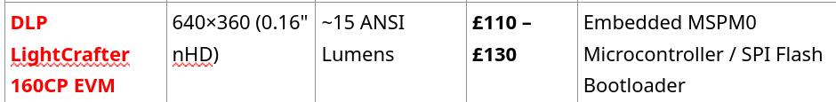
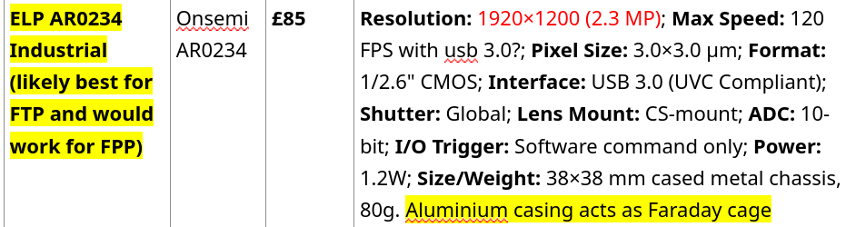
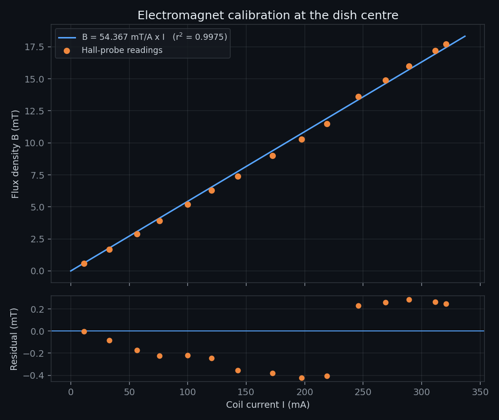

# Hardware

The bench is a fringe-projection profilometer built around one hard constraint: the
sample is a mirror-black, specular, moving liquid a few millimetres tall, sitting in a
magnetic field.

```
                  ┌──────────────┐
                  │  DLP 160CP   │   projector, tilted by θ
                  │   640×360    │
                  └──────┬───────┘
                         │  fringes, cross-polarised
                         ▼
     ┌──────────┐   ~~~~~~~~~~~~~~   ┌──────────────┐
     │  camera  │──▶  ferrofluid  ◀──│  coil + Hall │
     │ AR0234   │      in dish       │    probe     │
     └──────────┘   ~~~~~~~~~~~~~~   └──────────────┘

  height  ∝  (fringe displacement Δy) × tan θ × mm_per_pixel
```

The projector and camera are separated by a baseline and the projector is tilted. A
surface that rises toward the projector intercepts each fringe earlier, so the fringe
appears displaced in the camera image. That displacement, times the tangent of the
tilt, is height — which is why the Phase 2 pose solve carries so much weight.

---

## Projector — DLP LightCrafter 160CP EVM



| | |
|---|---|
| Resolution | 640 × 360 (0.16" nHD DMD) |
| Brightness | ~15 ANSI lumens |
| Control | Embedded MSPM0 microcontroller, SPI flash bootloader |
| Cost | £110 – £130 |

**Why a DMD projector rather than a laser line.** A DMD puts an arbitrary,
*digitally defined* pattern on the surface — checkerboards for intrinsics, asymmetric
circle grids for pose, fringes for reconstruction — from the same fixture, with no
moving parts. A scanned laser line would need mechanical sweeping and would not give a
calibration target.

The 640×360 native resolution is the reason every generator in `patterns/` authors at
exactly 640×360 and letterboxes rather than scales. Any resampling between the
generator and the DMD blurs the edges the corner and blob detectors depend on.

Low brightness is not a problem here: the working distance is short and the camera is
free to integrate. The optical difficulty is the opposite one — too much light coming
back from the wrong place.

---

## Camera — ELP AR0234, Onsemi sensor



| | |
|---|---|
| Sensor | Onsemi AR0234, 1/2.6" CMOS |
| Resolution | 1920 × 1200 (2.3 MP) |
| Shutter | **Global** |
| Frame rate | up to 120 fps over USB 3.0 |
| Pixel size | 3.0 × 3.0 µm |
| ADC | 10-bit |
| Interface | USB 3.0, UVC compliant |
| Body | 38 × 38 mm cased metal chassis, 80 g, 1.2 W |
| Cost | £85 |

**Global shutter is the requirement, not a preference.** A rolling shutter exposes
rows sequentially; on a surface that is oscillating as it destabilises, that shears
the fringe pattern row by row and writes a time gradient into what is supposed to be a
spatial measurement. Every fringe displacement would carry an unknown timing error.

The **aluminium casing acts as a Faraday cage** — useful when the sensor sits next to
a driven coil.

UVC compliance means it works through plain `cv2.VideoCapture` with no vendor SDK.
`acquisition/CamLive.py` requests 1920×1080; note the sensor's native 1920×**1200**, so
the driver crops. Keep whichever mode you calibrate in, since `mm_per_pixel` and the
principal point are tied to it.

---

## Optics — crossed polarisers

Ferrofluid is essentially black and essentially specular: it absorbs the diffuse
component and returns a mirror highlight. A projected fringe either vanishes into the
absorption or blows out into a specular hotspot, and the hotspot moves as the surface
moves.

A linear polariser on the projector and a second one crossed on the camera fixes this.
Specular reflection preserves polarisation, so the crossed analyser rejects it;
sub-surface scattering depolarises, so the diffuse component survives. What reaches
the sensor is the fringe geometry rather than the reflection of the lamp.

It is not a complete fix — hence the glare-suppression stage in every reconstruction
generation, and the human-in-the-loop tracing path in `Gen9.py` for frames where the
centre is unrecoverable.

---

## Magnetic field — coil and Hall probe

Field at the dish centre was calibrated against coil current with a Hall probe over
0 – 17.7 mT ([`data/electromagnet_calibration.csv`](../data/electromagnet_calibration.csv)):

<p align="center">
  
</p>

```
B(I) = 54.37 ± 0.37 mT/A        r² = 0.9975,  residual RMS 0.28 mT
V(I) = 94.84 Ω                  (coil resistance from the same sweep)
```

Linear through the origin across the whole range — the core is nowhere near
saturation, so current is a faithful proxy for field and every recorded drive point
converts to a field strength. The residuals show a shallow systematic curve
(negative mid-range, positive at both ends) at the ±0.3 mT level, consistent with a
slight onset of core non-linearity and with Hall-probe placement repeatability.

Regenerate with:

```bash
python analysis/field_calibration.py --plot assets/figures/field_calibration.png
```

---

## Sample

The ferrofluid parameters used in [`theory/FerroSim.py`](../theory/FerroSim.py):

| Property | Value |
|---|---|
| Particle density | 5323 kg/m³ (magnetite) |
| Particle volume fraction | 0.0914 |
| Particle saturation magnetisation | 265 kA/m |
| Carrier | 65% undecane / 35% hexane |
| Carrier density | 730 / 659 kg/m³ |
| Carrier surface tension | 1.88×10⁻² / 1.17×10⁻² N/m |

Giving bulk values of ρ = 1127 kg/m³, γ = 0.0163 N/m and M_sat = 24.2 kA/m.

The dish is held in a horizontal plane with the coil axis vertical, so the field is
normal to the free surface — the geometry the Rosensweig analysis assumes. The
reconstruction field of view is roughly 36 × 36 mm.
